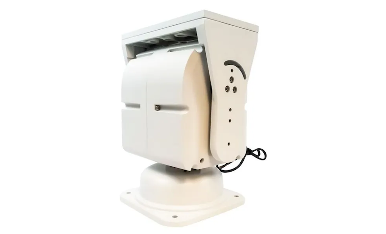

## pelco_d_rotator

### Description

Это приложение выполняет функцию моста между стандатным протоколом rotctl и устройствами, управляемыми по протоколу
PELCO-D, чтобы использовать их для позиционирования антенны при отслеживании спутников.

Не смотря на то что в протоколе PELCO-D есть команда для прямого указания необходимого азимута и угла места (pan и
tilt в терминах PELCO-D), большинство устройств PELCO-D не могут откликаться на другие команды, во время исполнения
команды с абсолютными координатами, поэтому в приложении используется иной подход. Отслеживаиется разница между
текущими и целевыми углами и передаются команды на поворот осей в нужную сторону, пока не будут достигнуты
целевые значения углов.

Этот мост тестировался с программами управления gpredict и rotctl.

Я использую этот мост с поворотным устройством 3050(DZ), подключенным по шине RS-485.



[Aliexpress link](https://aliexpress.ru/item/1005008588968258.html)  
[OZON link](https://www.ozon.ru/product/ulichnoe-povorotnoe-ustroystvo-dlya-kamer-videonablyudeniya-3050-dz-rs-485-q22580305-povorotnoe-1508008122/)  

Для использования с антеннами в поворотном устройстве требуется сделать 2 модификации:
1. Снять один из стопорных уголков вертикальной оси на основании устройства, чтобы дать ему возможность вращения на полные 360 градусов
2. Повернуть оба стопорных уголка горизонтальной оси во "внешнюю" сторону, чтобы дать ему возможность вращения на полные 90 градусов

Это устройство является простой и достаточно дешевой альтернативой специализированным антенным поворотным устройствам.

### Использование

Скачайте код

```
git clone https://github.com/belovictor/pelco_d_rotator.git
cd pelco_d_rotator
```


Установите зависимости

```
pip install -r requirements.txt
```

Параметры командной строки

```
usage: pelco_rotator [-h] -p PORT [-b BAUD] [-i PELCOID]

A rotctl to pelco-d bridge

options:
  -h, --help            show this help message and exit
  -p PORT, --port PORT  Serial port device name
  -b BAUD, --baud BAUD  Serial port baudrate, default 9600
  -i PELCOID, --pelcoid PELCOID
                        PELCO-D device id, default 1
```

Запустите программу (пример)

```
./pelco_rotator.py -p /dev/cu.usbserial-FT1GLXM1 -i 2
```


В программе использован незначительно измененный код протокола PELCO-D [jn0 gist](https://gist.github.com/jn0/cc5c78f4a0f447a6fb2e45a5d9efa13d)
