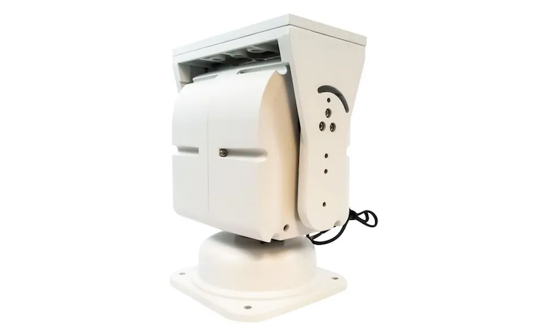

## pelco_d_rotator

[Russian README](README-ru.md)

### Description

This is a bridge between standard rotctl protocol and PELCO-D to use PELCO-D rotators to position antenna while
tracking satellites.

Though, PELCO-D protocol have a command for directly specifying target azimuth and elevation (pan and tilt in PELCO-D
terms), most of PELCO-D devices are not able to respond to commands while executing this position command. Because of
that a different approach was taken where bridge tracks current position from PELCO-D device continuously and issues
pan and tilt commands depending on the difference between current and target azimuth and elevation.

This bridge was tested against gpredict and rotctl and is fully functional at least with those programs.

I use this bridge with 3050(DZ) rotator through RS-485 connection  



I did two small modifications to it:
1. Remove one of the two pan stop brackets to make it full 360 degrees on azimuth axis
2. Make sure that both stop brackets on tilt axis are turned "outside" to make it full 90 degrees on elevation axis

This can be a simple and more or less cheap replacement for specialized antenna rotators.

### Usage

Get the code

```
git clone https://github.com/olyashik/PelcoRotators.git
cd PelcoPotators
```


Install requirments

```
pip install -r requirements.txt
```

Program arguments

```
usage: pelco_rotator [-h] -p PORT [-b BAUD] [-i PELCOID]

A rotctl to pelco-d bridge

options:
  -h, --help            show this help message and exit
  -p PORT, --port PORT  Serial port device name
  -b BAUD, --baud BAUD  Serial port baudrate, default 9600
  -i PELCOID, --pelcoid PELCOID
                        PELCO-D device id, default 1
```

Run the program (example)

```
./pelco_rotator.py -p /dev/cu.usbserial-FT1GLXM1 -i 2
```


PELCO-D protocol code is a slightly modified version of [jn0 gist](https://gist.github.com/jn0/cc5c78f4a0f447a6fb2e45a5d9efa13d)
